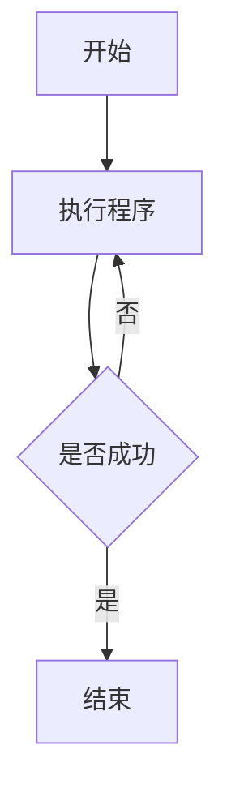
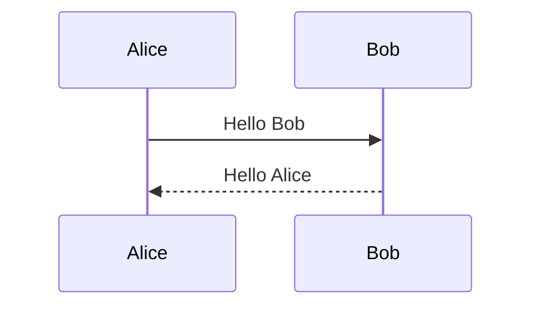
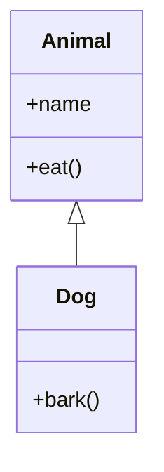
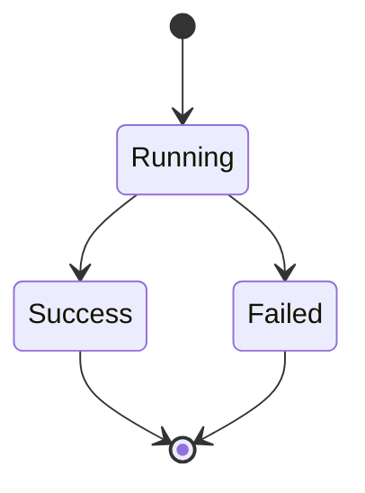
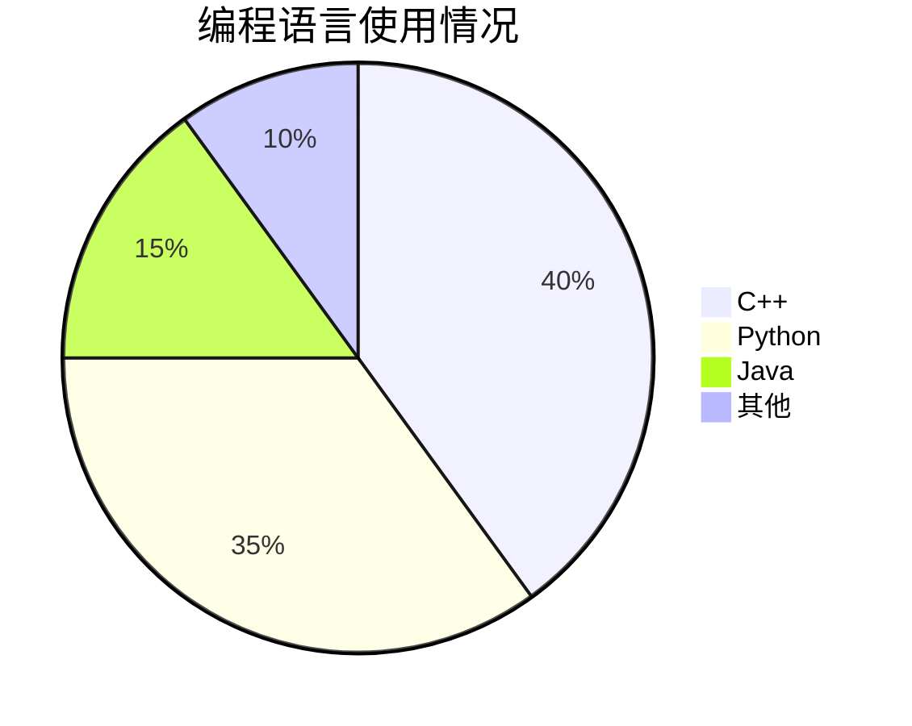

下面是一份可以直接复制保存的 Markdown 语法速查表，按照功能分类，并尽量用「源码 → 效果」的方式展示。

````markdown
# Markdown 完整功能速查

## 1. 标题

# 一级标题
## 二级标题
### 三级标题
#### 四级标题
##### 五级标题
###### 六级标题

---

## 2. 段落与换行

这是第一段。

这是第二段。

这是同一段中的  
强制换行。

---

## 3. 粗体

**这是粗体**

__这也是粗体__

---

## 4. 斜体

*这是斜体*

_这也是斜体_

---

## 5. 粗体 + 斜体

***这是粗体斜体***

___这也是粗体斜体___

---

## 6. 删除线

~~这是删除线~~

---

## 7. 下划线

Markdown 原生没有标准的下划线语法。

可以使用 HTML：

<u>这是下划线</u>

---

## 8. 高亮

标准 Markdown 没有高亮语法。

部分 Markdown 编辑器支持：

==这是高亮==

---

## 9. 行内代码

这是 `printf()` 函数。

---

## 10. 代码块

```cpp
#include <iostream>

int main() {
    std::cout << "Hello World";
    return 0;
}
````

指定语言后可以获得语法高亮。

常见语言：

````text
```cpp
```c
```python
```java
```javascript
```html
```css
```bash
```json
```text
````

---

## 11. 引用

> 这是引用。

多层引用：

> 第一层
>
> > 第二层
> >
> > > 第三层

---

## 12. 无序列表

* 第一项
* 第二项
* 第三项

也可以使用：

* 第一项
* 第二项

或者：

* 第一项
* 第二项

---

## 13. 有序列表

1. 第一项
2. 第二项
3. 第三项

---

## 14. 嵌套列表

* 第一层

  * 第二层

    * 第三层
  * 第二层
* 第一层

---

## 15. 任务列表

* [ ] 未完成
* [x] 已完成

---

## 16. 超链接

[这是一个链接](https://example.com)

鼠标悬停显示提示：

[这是一个链接](https://example.com "这是提示文字")

---

## 17. 自动链接

[https://example.com](https://example.com)

[example@example.com](mailto:example@example.com)

---

## 18. 图片


也可以添加标题：


---

## 19. 水平分割线

---

---

---

---

## 20. 转义字符

如果想让 Markdown 符号本身显示出来，可以使用反斜杠：

*这不是斜体*

# 这不是标题

> 这不是引用

常见需要转义的字符：

* _ # + - . ! \( \) \( \) ` > \

---

## 21. 表格

| 姓名 | 年龄 | 专业   |
|------|------|--------|
| 张三 | 18   | 计算机 |
| 李四 | 19   | 数学   |

---

## 22. 表格对齐

| 左对齐 | 居中 | 右对齐 |
|:-------|:----:|-------:|
| A      |  B   |      C |
| 1      |  2   |      3 |

语法：

| 左对齐 | 居中 | 右对齐 |
|:-------|:----:|-------:|

---

## 23. 表格中使用 Markdown

| 功能   | 示例     |
|--------|----------|
| 粗体   | **粗体** |
| 斜体   | *斜体*   |
| 代码   | `code`   |
| 删除线 | ~~删除~~ |

---

## 24. 转义竖线

表格中如果需要显示 `|`：

| 内容 |
|------|
| A | B |

---

## 25. HTML

Markdown 通常可以混合 HTML。

<b>粗体</b>

<i>斜体</i>

<u>下划线</u>

<mark>高亮</mark>

<sup>上标</sup>

<sub>下标</sub>

---

## 26. 上标

Markdown 本身没有统一的上标语法。

可以使用 HTML：

x<sup>2</sup>

---

## 27. 下标

H<sub>2</sub>O

CO<sub>2</sub>

---

## 28. 注释

Markdown 没有标准的注释语法。

通常使用 HTML 注释：

<!-- 这是注释 -->

<!--
这是多行注释
不会显示在页面上
-->

---

## 29. 转义反引号

如果需要显示反引号：

`` ` ``

如果代码中本身包含反引号，可以使用两个反引号：

``这是 `代码` ``

---

## 30. 链接引用

可以把链接地址单独定义：

[百度][baidu]

[baidu]: https://www.baidu.com

也可以：

[百度][]

[百度]: https://www.baidu.com

---

## 31. 图片引用

![示例图片][image]

[image]: https://example.com/image.png

---

## 32. 自动生成目录

Markdown 标准语法没有目录功能。

部分编辑器支持：

[[toc]]

或者使用插件自动生成目录。

---

## 33. 脚注

部分 Markdown 方言支持：

这是一个脚注[^1]。

[^1]: 这是脚注内容。

---

## 34. 数学公式

很多 Markdown 编辑器支持 LaTeX。

行内公式：

$E = mc^2$

块级公式：

$$
E = mc^2
$$

例如：

$$
\sum_{i=1}^{n} i
$$

---

## 35. 常用数学公式

$$
a^2 + b^2 = c^2
$$

$$
\frac{a}{b}
$$

$$
\sqrt{x}
$$

$$
\int_a^b f(x)\,dx
$$

$$
\sum_{i=1}^{n} i
$$

---

## 36. 流程图

部分 Markdown 编辑器支持 Mermaid：



---

## 37. Mermaid 时序图



---

## 38. Mermaid 类图



---

## 39. Mermaid 状态图



---

## 40. Mermaid 饼图



---

## 41. 折叠内容

Markdown 本身没有标准折叠语法。

可以使用 HTML：

<details>
<summary>点击展开</summary>

这里是隐藏的内容。

可以放 Markdown：

* 第一项
* 第二项

</details>

---

## 42. 锚点

部分 Markdown 环境支持 HTML 锚点：

<a id="top"></a>

跳转到顶部：

[返回顶部](#top)

---

## 43. 强制换行

方法一：

这一行结束后有两个空格
这一行会换行。

方法二：

这一行结束后使用 HTML<br>
这一行也会换行。

---

## 44. 空格

Markdown 会自动合并普通空格。

如果需要多个连续空格，可以使用 HTML：

A   B

---

## 45. 特殊字符

版权：

©

注册商标：

®

商标：

™

大于：

>

小于：

<

与：

&

---

## 46. Emoji

部分 Markdown 环境支持直接使用 Emoji：

😀 😎 👍 ❤️ 🔥 🚀

GitHub 等平台还支持：

:smile:

:rocket:

:+1:

---

## 47. 定义列表

部分 Markdown 方言支持：

Markdown
: 一种轻量级标记语言

C++
: 一种编程语言

---

## 48. 警告框

部分 Markdown 平台支持：

> [!NOTE]
> 这是提示信息。

> [!TIP]
> 这是技巧信息。

> [!WARNING]
> 这是警告信息。

> [!IMPORTANT]
> 这是重要信息。

> [!CAUTION]
> 这是注意事项。

---

## 49. 键盘按键

Markdown 没有标准键盘按键语法。

可以使用 HTML：

<kbd>Ctrl</kbd> + <kbd>C</kbd>

<kbd>Ctrl</kbd> + <kbd>Shift</kbd> + <kbd>P</kbd>

---

## 50. HTML 表格

当 Markdown 表格无法满足需求时，可以直接使用 HTML：

<table>
<tr>
<th>姓名</th>
<th>年龄</th>
</tr>
<tr>
<td>张三</td>
<td>18</td>
</tr>
</table>

---

# 常用语法速查

| 功能     | Markdown       |
|----------|----------------|
| 一级标题 | `# 标题`       |
| 二级标题 | `## 标题`      |
| 粗体     | `**文字**`     |
| 斜体     | `*文字*`       |
| 粗斜体   | `***文字***`   |
| 删除线   | `~~文字~~`     |
| 行内代码 | `` `代码` ``   |
| 引用     | `> 引用`       |
| 无序列表 | `- 项目`       |
| 有序列表 | `1. 项目`      |
| 任务列表 | `- [ ] 项目`   |
| 超链接   | `[文字](URL)`  |
| 图片     | `` |
| 分割线   | `---`          |
| 表格     | `\| A \| B \|` |
| 行内公式 | `$公式$`       |
| 块级公式 | `$$公式$$`     |
| 代码块     | ` ```语言 `                |
| 换行      | 行末两个空格                   |
| HTML    | `<标签>内容</标签>`            |
| 注释      | `<!-- 注释 -->`            |
| 上标      | `<sup>文字</sup>`          |
| 下标      | `<sub>文字</sub>`          |
| 下划线     | `<u>文字</u>`              |
| 高亮      | `<mark>文字</mark>`        |
| 折叠      | `<details>...</details>` |
| 脚注      | `[^1]`                   |
| Mermaid | ` ```mermaid `           |

---

# 最常用的组合

## 标题 + 列表

## 学习计划

1. 学习 C++
2. 学习 STL
3. 学习数据结构
4. 学习算法

---

## 引用 + 代码

> C++ 中可以使用 `vector` 保存动态数组。

```cpp
std::vector<int> a;
a.push_back(10);
```

---

## 表格 + 代码

| 函数          | 作用         | 示例              |
|---------------|--------------|-------------------|
| `push_back()` | 尾部添加元素 | `v.push_back(10)` |
| `pop_back()`  | 删除尾部元素 | `v.pop_back()`    |
| `size()`      | 获取元素数量 | `v.size()`        |

---

## 数学公式 + 代码

二次方程：

$$
ax^2 + bx + c = 0
$$

C++ 实现：

```cpp
double delta = b * b - 4 * a * c;
```

---

# 注意

Markdown **不是只有一种标准实现**。

最基础的 Markdown 语法在不同平台基本通用，但下面这些功能通常属于 Markdown 方言或扩展：

* 数学公式
* Mermaid
* 脚注
* 高亮
* 警告框
* 折叠内容
* 上标 / 下标
* HTML
* 自动目录

因此，同一份 `.md` 文件在 **VS Code、GitHub、Typora、Obsidian、Jupyter Notebook、博客平台** 中显示效果可能不同。

```

其中最值得优先掌握的是：**标题 → 粗体/斜体/删除线 → 列表 → 引用 → 代码块 → 链接/图片 → 表格 → 数学公式 → Mermaid**。这些基本覆盖了日常写笔记、写 README、写技术文档时的大部分需求。
```
