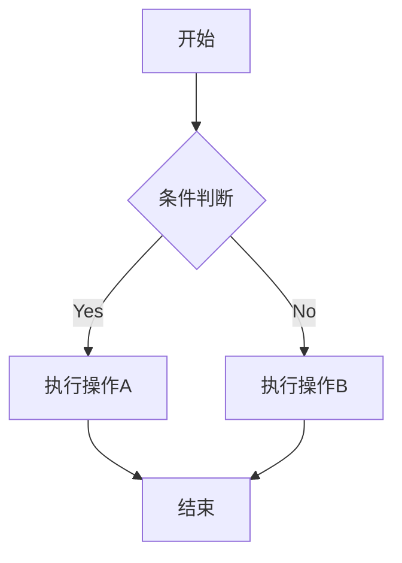

# markdown
1. a
    1. b
        - [] list1
        - [ ] list2
2. aa
3. ==test==
4. ***test2***
5. ~~aaa~~
   - first
   - second
   - <u>third</u>

| ~~表格~~ | *表格* |
|:---|:---:|
| **data1** | ==data2== |

这是一个脚注[^1]12345
***
1. again?
2. again!
***
> quote 
> quote
>
***
```cpp {.line-numbers}
#include<iostream>
int main(){
    std::cout << "Fxxk U World!!!"
}
```
`这也行吗`  

markdown联系我：[发送邮件](mailto:example@email.com)
电话联系：[拨打电话](tel:+86-138-0013-8000)

- 这是一个链接[bangumi](https://bgm.tv "bangumi nb")
- 文字[bgm][bgm]
  
妖梦可爱[](https://bilibili.com)


***
<div align = "center">

</div>


<div align = "center">
<span style="color : red;font-size : 100px">
test<br>
test2
</span>
</div>

$sin(x) = 13 + sin(2x)$

$$
\begin{pmatrix}
   1 & 2 & 3\\
   4 & 5 & 6\\
   7 & 8 & 9
\end{pmatrix}
$$


***


[bgm]: https://bgm.tv
[^1]: yeahhhh 
